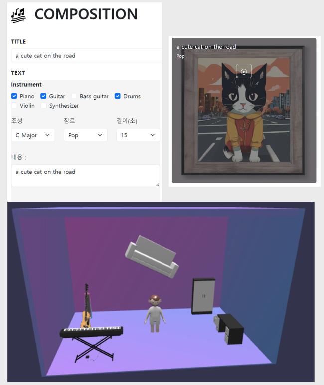

# AI 기반 음악 창작 플랫폼

**개발기간**: 2023.10.01~2023.11.30  
**플랫폼**: Web  
**개발 인원**: 5명  

## 프로젝트 목적
AI를 활용하여 음악과 앨범 아트를 창작하고 공유하는 플랫폼을 구축합니다.

## 담당 역할
- **생성형 AI 모델 서빙**
- **BLIP 모델을 활용하여 사용자가 입력한 이미지의 키워드 추출**
- **GPT API를 통한 텍스트의 장르, 느낌, 이미지 스타일 추출 작업**
- **Stable Diffusion 프롬프트 튜닝을 통한 앨범 아트 생성**
- **MusicGen 모델을 이용한 맞춤형 음악 생성**

## 사용 언어
- Python
- JavaScript
- Babylon.JS

## 사용 기술
- Stable Diffusion
- MusicGen
- Blip

## 프로젝트 내용
이 프로젝트는 사용자 입력(텍스트, 이미지)을 기반으로 음악과 앨범 아트를 AI가 생성하는 플랫폼 개발에 초점을 맞췄습니다. 이는 사용자가 선택한 악기, 장르, 조성, 음악의 감각에 따라 음악을 생성합니다. 개발 과정에는 Python, Huggingface, GPT API를 활용하였고, BLIP, Stable Diffusion, MusicGen 모델의 조합과 최적화에 대한 이해를 얻었습니다. 이는 LLM을 포함한 다양한 AI 모델의 실용적 활용과 튜닝 경험을 제공했습니다.

## 기능
### 사용자 입력 기반 음악 및 앨범 아트 생성
사용자가 **텍스트** 또는 **이미지**를 입력하면, AI가 이를 기반으로 음악과 앨범 아트를 창작합니다.

### 사용자 설정에 따른 음악 생성
사용자가 **악기, 장르, 조성, 음악의 느낌** 등을 설정하면, 그에 맞추어 음악이 생성됩니다.

### 가상공간
나만의 **가상공간**에서 다른 사용자들과 생성한 음악을 공유하며, **소통**을 할 수 있습니다.

